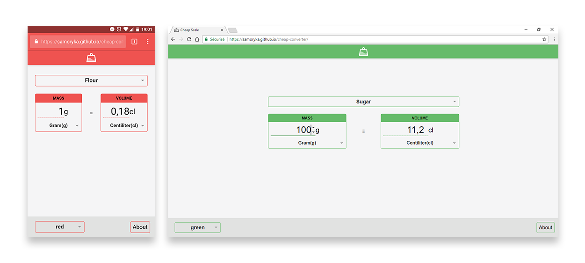

## Motivation
I did not want to spend money on a scale to weigh the ingredients I use while cooking since I already have means to measure their volumes.

Making a weight/volume converter was thus the perfect occasion to learn how to use Node.js, React and other JavaScript frameworks/libraries/tools.

## Screenshots

